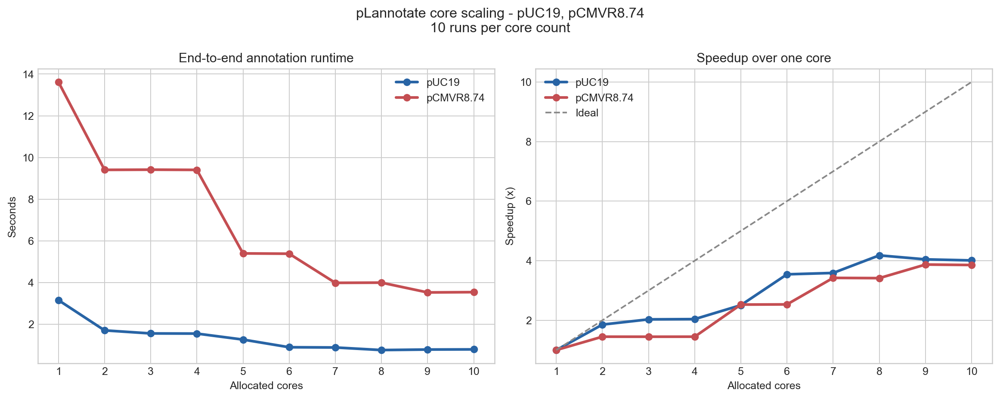

[](https://www.gnu.org/licenses/gpl-3.0)

[](https://doi.org/10.1093/nar/gkab374)
[](http://bioconda.github.io/recipes/plannotate/README.html)


Online Annotation
=================

pLannotate is web server for automatically annotating engineered plasmids.

Please visit http://plannotate.barricklab.org/


Local Installation
==================
To use pLannotate from Python or the command line, follow the instructions below.
### Quick install

The easiest way to install is via [conda](https://docs.conda.io/en/latest/):

```bash
conda create -n plannotate -c conda-forge -c bioconda plannotate
```

Then activate the `plannotate` conda environment (`conda activate plannotate`) and proceed with using pLannotate (see **Using pLannotate locally** below).


### Installing from source
Installing from source uses conda for the external BLAST, DIAMOND, and Infernal
executables. Clone or unpack the repository, then run:

On the command line, navigate into the `pLannotate` folder.

```bash
conda env create -f environment.yml
conda activate plannotate
```

For HTML and notebook plots, install the optional plotting dependency when
installing from PyPI or source:

```bash
pip install 'plannotate[plot]'
```

After installation, run the following command to download the database files:
```bash
plannotate setupdb
```

Using pLannotate locally
=====
### Command Line Interface (batch mode)

To annotate FASTA or GenBank files and generate the interactive plasmid maps on the command line,
follow the above instructions to install pLannotate.

Run `plannotate batch --help` for the complete, version-accurate option list.

Example usage:
```
plannotate batch -i ./plannotate/data/fastas/pUC19.fa --cores 4 --html --output ~/Desktop/ --file-name pLasmid
```

Each configured database is an independent search. `--cores 4` allows BLAST,
DIAMOND, and Infernal searches to run concurrently while results remain in YAML
configuration order. Every active search receives one thread before spare cores
are assigned in configuration order.

#### Annotation performance

The runtime pipeline parallelizes independent database searches first, then
assigns spare threads to the underlying search tools. The figure below shows
end-to-end annotation time and speedup for two example plasmids, using 10
independent runs at each core count. Absolute runtimes are machine-dependent;
the relevant result is the scaling trend.



Custom databases can be added by supplying pLannotate a custom YAML file. To create the default YAML file, enter the following command:
```
plannotate yaml > plannotate_default.yaml
```

Edit this configuration to point to custom databases, then pass it with
`--yaml-file`.

The YAML contains search configuration only. To inspect the versions and
checksums of the installed database bundle, run `plannotate databases`.

### Using within Python

You can also directly import pLannotate as a Python module:

```python
from plannotate import Construct

seq = "tgaccaggcatcaaataaaacgaaaggctcagtcgaaagactgggcctttcgttttatctgttgtttgtcggtgaacgctctctactagagtcacactggctcaccttcgggtgggcctttctgcgtttataggtctcaatccacgggtacgggtatggagaaacagtagagagttgcgataaaaagcgtcaggtagtatccgctaatcttatggataaaaatgctatggcatagcaaagtgtgacgccgtgcaaataatcaatgtggacttttctgccgtgattatagacacttttgttacgcgtttttgtcatggctttggtcccgctttgttacagaatgcttttaataagcggggttaccggtttggttagcgagaagagccagtaaaagacgcagtgacggcaatgtctgatgcaatatggacaattggtttcttgtaatcgttaatccgcaaataacgtaaaaacccgcttcggcgggtttttttatggggggagtttagggaaagagcatttgtcatttgtttatttttctaaatacattcaaatatgtatccgctcatgagacaataaccctgataaatgcttcaataatattgaaaaaggaagagtatgagtattcaacatttccgtgtcgcccttattcccttttttgcgg"

# Annotate once and export through the Construct API.
construct = Construct(seq, detailed=True, linear=True, cores=4)
hits = construct.annotations_df
seq_record = construct.to_seqrecord()
genbank_text = construct.to_genbank()
html = construct.to_html()
```

To rebuild the complete database bundle from its upstream sources, install the
database-build dependencies and call the top-level build API:

```python
from plannotate import build_databases

archive = build_databases("database-build", cores=4)
```

About
=====
pLannotate was developed and is maintained by [Matt McGuffie](https://twitter.com/matt_mcguffie) at the [Barrick lab](https://barricklab.org/twiki/bin/view/Lab), University of Texas at Austin, Austin, Texas.
