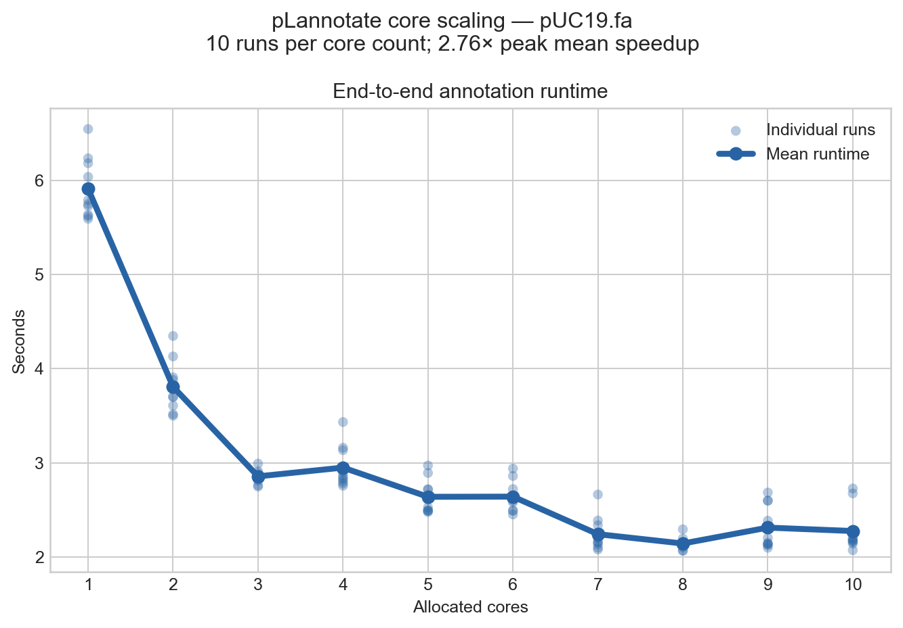

[](https://www.gnu.org/licenses/gpl-3.0)

[](https://doi.org/10.1093/nar/gkab374)
[](http://bioconda.github.io/recipes/plannotate/README.html)


Online Annotation
=================

pLannotate is web server for automatically annotating engineered plasmids.

Please visit http://plannotate.barricklab.org/


Local Installation
==================
To use pLannotate from Python or the command line, follow the instructions below.
### Quick install

The easiest way to install is via [conda](https://docs.conda.io/en/latest/):

```bash
conda create -n plannotate -c conda-forge -c bioconda plannotate
```

Then activate the `plannotate` conda environment (`conda activate plannotate`) and proceed with using pLannotate (see **Using pLannotate locally** below).


### Installing from source
Installing from source uses conda for the external BLAST, DIAMOND, Infernal,
and tRNAscan-SE executables. Clone or unpack the repository, then run:

On the command line, navigate into the `pLannotate` folder.

```bash
conda env create -f environment.yml
conda activate plannotate
```

For HTML and notebook plots, install the optional plotting dependency when
installing from PyPI or source:

```bash
pip install 'plannotate[plot]'
```

After installation, run the following command to download the database files:
```bash
plannotate setupdb
```

Using pLannotate locally
=====
### Command Line Interface

After installation, you can use pLannotate directly from the command line. See the **Command Line Interface (batch mode)** section below for details.

### Command Line Interface (batch mode)

To annotate FASTA or GenBank files and generate the interactive plasmid maps on the command line,
follow the above instructions to install pLannotate.

We can check the options using the following command:

`plannotate batch --help`

```
Usage: plannotate batch [OPTIONS]

  Annotates engineered DNA sequences, primarily plasmids. Accepts a FASTA file
  and outputs a gbk file with annotations, as well as an optional interactive
  plasmid map as an HTLM file.

Options:
  -i, --input TEXT      location of a FASTA or GBK file
  -o, --output TEXT     location of output folder. DEFAULT: current dir
  -f, --file_name TEXT  name of output file (do not add extension). DEFAULT:
                        input file name

  -s, --suffix TEXT     suffix appended to output files. Use '' for no suffix.
                        DEFAULT: '_pLann'

  -y, --yaml_file TEXT  path to YAML file for custom databases. DEFAULT:
                        builtin

  -l, --linear          enables linear DNA annotation
  -h, --html            creates an html plasmid map in specified path
  -c, --csv             creates a cvs file in specified path
  -d, --detailed        uses modified algorithm for a more-detailed search
                        with more false positives

  -j, --cores INTEGER   maximum database searches to run in parallel

  -x, --no_gbk          supresses GenBank output file
  --help                Show this message and exit.
  ```

Example usage:
```
plannotate batch -i ./plannotate/data/fastas/pUC19.fa --cores 4 --html --output ~/Desktop/ --file_name pLasmid
```

Each configured database is an independent Snakemake job. `--cores 4` therefore
allows the BLAST, DIAMOND, and Infernal searches to run concurrently while the
combined hit filtering remains deterministic. Every database receives one thread
before spare cores are assigned to Rfam, then DIAMOND, then BLAST searches.

#### Annotation performance

The runtime pipeline parallelizes independent database searches first, then
assigns spare threads to the underlying search tools. The figure below shows
end-to-end pUC19 annotation time for this release, using 10 independent runs at
each core count. Absolute runtimes are machine-dependent; the relevant result is
the scaling trend.



Custom databases can be added by supplying pLannotate a custom YAML file. To create the default YAML file, enter the following command:
```
plannotate yaml > plannotate_default.yaml
```

This configuration file can be edited to point to other external databases that you wish to use. When launching pLannotate, you can specify the path to your custom YAML file using the `--yaml_file` option. 

The YAML contains search configuration only. To inspect the versions and
checksums of the installed database bundle, run `plannotate databases`.

### Using within Python

You can also directly import pLannotate as a Python module:

```python
from plannotate import Construct

seq = "tgaccaggcatcaaataaaacgaaaggctcagtcgaaagactgggcctttcgttttatctgttgtttgtcggtgaacgctctctactagagtcacactggctcaccttcgggtgggcctttctgcgtttataggtctcaatccacgggtacgggtatggagaaacagtagagagttgcgataaaaagcgtcaggtagtatccgctaatcttatggataaaaatgctatggcatagcaaagtgtgacgccgtgcaaataatcaatgtggacttttctgccgtgattatagacacttttgttacgcgtttttgtcatggctttggtcccgctttgttacagaatgcttttaataagcggggttaccggtttggttagcgagaagagccagtaaaagacgcagtgacggcaatgtctgatgcaatatggacaattggtttcttgtaatcgttaatccgcaaataacgtaaaaacccgcttcggcgggtttttttatggggggagtttagggaaagagcatttgtcatttgtttatttttctaaatacattcaaatatgtatccgctcatgagacaataaccctgataaatgcttcaataatattgaaaaaggaagagtatgagtattcaacatttccgtgtcgcccttattcccttttttgcgg"

# Annotate once and export through the Construct API.
construct = Construct(seq, detailed=True, linear=True, cores=4)
hits = construct.annotations_df
seq_record = construct.to_seqrecord()
genbank_text = construct.to_genbank()
html = construct.to_html()
```

About
=====
pLannotate was developed and is maintained by [Matt McGuffie](https://twitter.com/matt_mcguffie) at the [Barrick lab](https://barricklab.org/twiki/bin/view/Lab), University of Texas at Austin, Austin, Texas.
