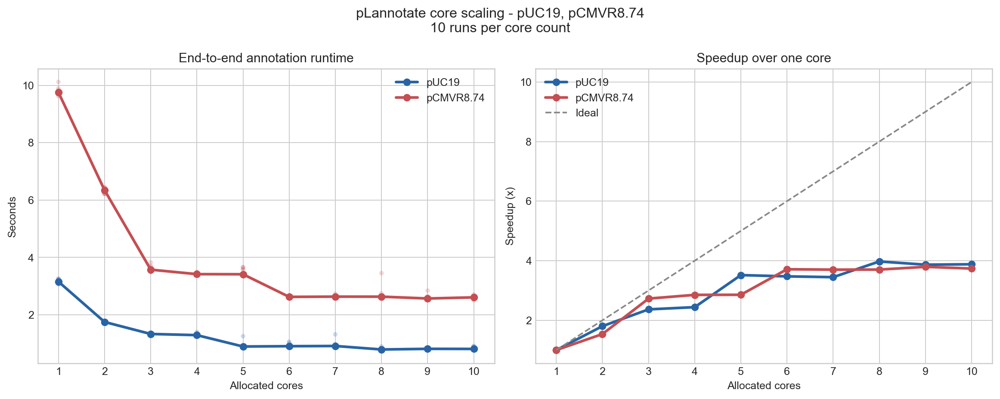

[](https://www.gnu.org/licenses/gpl-3.0)

[](https://doi.org/10.1093/nar/gkab374)
[](http://bioconda.github.io/recipes/plannotate/README.html)


pLannotate is a CLI tool, Python library, and web server for automatically annotating engineered plasmids and other engineered DNA.

Visit http://plannotate.barricklab.org/ for web server.


Local Installation
==================
To use pLannotate from Python or the command line, follow the instructions below.
### Quick install

The easiest way to install is with [mamba](https://mamba.readthedocs.io/) (a
fast, drop-in replacement for conda; the lightweight
[micromamba](https://mamba.readthedocs.io/en/latest/user_guide/micromamba.html)
works too — just swap in `micromamba`):

```bash
mamba create -n plannotate -c conda-forge -c bioconda plannotate
```

Then activate the environment and proceed with using pLannotate (see **Using
pLannotate locally** below):

```bash
mamba activate plannotate
```


### Installing from source / pip
Installing from source uses conda-forge/bioconda for the external BLAST,
DIAMOND, and Infernal executables. Clone or unpack the repository, navigate into
the `pLannotate` folder, then create and activate the environment:

```bash
mamba env create -f environment.yml
mamba activate plannotate
```

This installs the package in editable mode with the `test` and `lint` extras. To
install the package directly instead (from PyPI or a source checkout), use pip:

```bash
pip install plannotate            # core CLI + Python API
pip install 'plannotate[plot]'    # add HTML / notebook plots
```

pLannotate requires Python 3.10 or newer.

After installation, download the annotation databases:
```bash
plannotate setupdb
```

> [!NOTE]
> pLannotate is not currently hosted on PyPi in order to reduce installation confusion. Because the 3rd party, non-python dependencies are critical for use, a PyPi release is of limited use. If you would like to `pip` install for whatever reason, you can use this repo as your package source and build the wheel manually.

### Optional dependencies

The core install is deliberately lean. Extra features live behind package extras, so
you only pull in what you need:

| extra        | `pip install 'plannotate[...]'` | what it adds                                              |
| ------------ | ------------------------------- | -------------------------------------------------------- |
| `plot`       | `plannotate[plot]`              | Bokeh, for interactive `--html` maps and notebook plots  |
| `server`     | `plannotate[server]`            | Streamlit web app (`plannotate streamlit`), plus Bokeh   |
| `databases`  | `plannotate[databases]`         | Snakemake pipeline for rebuilding the database bundle     |
| `test`       | `plannotate[test]`              | test suite dependencies                                  |
| `lint`       | `plannotate[lint]`              | ruff, mypy, pyright, and other static-analysis tools     |

Extras combine, e.g. `pip install 'plannotate[plot,server]'`. The external
search tools (BLAST, DIAMOND, Infernal) are not pip packages — install them via
conda-forge/bioconda as shown above, or otherwise put them on your `PATH`.

Using pLannotate locally
=====
### Command Line Interface (batch mode)

To annotate FASTA or GenBank files and generate the interactive plasmid maps on the command line,
follow the above instructions to install pLannotate.

Run `plannotate batch --help` for the complete, version-accurate option list.

Example usage:
```
plannotate batch -i ./plannotate/data/fastas/pUC19.fa --cores 4 --html --output ~/Desktop/ --file-name pLasmid
```

#### Detailed-mode migration

The former detailed annotation behavior is now the only annotation behavior. Remove
`--detailed` or `-d` from command lines and remove `detailed=True` / `is_detailed=True`
from Python calls; those options are no longer accepted. Nested features of different
types are retained automatically, with the conservative policy from #83 applied by
default.

Each configured database is an independent search. `--cores 4` allows BLAST,
DIAMOND, and Infernal searches to run concurrently.

Core performance on an M1 Macbook Pro (...which only has 8 cores... oops):


Running independent database searches concurrently gives a **median ~4.6x
speedup on ten cores** over a single core across those ten plasmids (per-plasmid
range roughly 3.6x-5.1x), with larger, feature-rich plasmids benefiting most.

#### Fast mode

`--fast` runs a reduced search using only the SnapGene and FPbase databases,
skipping the slower Swiss-Prot (DIAMOND) and Rfam (Infernal) searches. It also
avoids doubling circular queries, instead stitching together the few features
that span the origin, so seam-spanning hits are still recovered. This trades
coverage (no RNA families, reduced protein coverage) for speed.

Because `fast` mode runs only two lightweight searches, **extra cores barely help**.
Some speed gains may be had when batching large numbers of plasmids in `fast` mode, however.

#### Origin-of-replication rotation

Passing `--rotate` (or `Construct(rotate=True)` in Python) re-frames a circular
plasmid so its origin of replication starts at base 1 on the forward strand,
giving a canonical, input-independent layout. The origin is chosen from a
curated, prevalence-ranked list of bacterial origins; if none is found, the
sequence is placed in a deterministic, rotation- and strand-invariant frame so
the same plasmid always yields the same output. Linear sequences are left
untouched.

Rotation is a framing step, not a speed optimization: it adds a small detection
search up front, and annotation itself is unchanged (circular sequences are
always fully doubled so origin-spanning features are never missed).

#### GenBank qualifiers

Alongside the usual `/label`, `/note`, `/identity`, and `/match_length`, each
exported feature carries the search evidence behind it and, where pLannotate
knows more about the feature than the database does, a little extra context:

| qualifier                              | meaning                                                                         |
| -------------------------------------- | ------------------------------------------------------------------------------- |
| `/subject_start`, `/subject_end`        | nucleotide-equivalent bounds of the matched part of the database entry           |
| `/btop`                                 | the search tool's compact alignment traceback (BLAST/DIAMOND only)               |
| `/structure`                            | the consensus secondary structure in WUSS notation (Rfam only)                   |
| `/selection_marker`, `/selection_agent`    | how a resistance or selection marker is selected for                             |
| `/copy_number`, `/copy_number_class`, `/copy_number_note` | the copy number an origin of replication confers  |
| `/domain`, `/host_range`                   | where the marker selects, or the origin replicates                               |
| `/reference`                               | the PMID(s) the curated entry is based on                                        |

Subject coordinates are normalized to nucleotide-equivalent units, including for a
translated DIAMOND hit, and `/btop` reads along the subject strand. GenBank wraps a
long qualifier value at a fixed width and readers rejoin
the wrapped lines with a space, so a `/btop` that does not fit on one line comes
back whitespace-separated; strip the whitespace to recover it, as a traceback
never contains any. The same applies to `/structure`, since WUSS notation
contains no whitespace either.

An Rfam hit is found by a covariance model, which scores how well a sequence fits
a family's *structure* rather than how many bases it matches — a canonical 5S rRNA
is only about 64% identical to its own consensus. Reporting that as identity would
rank every structured RNA far below its real quality, so for Rfam features
`/identity` carries the alignment's average posterior probability (Infernal's own
confidence, already on a 0–100 scale) rather than a percentage of matching bases.
`/structure` is the model's consensus secondary structure over the matched region,
and is the closest thing a covariance-model hit has to a traceback. It is indexed by
alignment column rather than by model position — cmscan's consensus structure includes
the alignment's insertion columns, so `/structure` is generally longer than
`subject_end - subject_start + 1` and should not be indexed against the model.

The selection-marker and copy-number qualifiers come from curated tables
(`plannotate/data/data/selection_markers.csv` and `ori_copy_number.csv`) matched
on the database and accession the hit came from, not on the feature name — a name
is a display label that several unrelated records can share. They are simply
absent for features that are not in the tables.

`/domain` is one of `bacterial`, `eukaryotic`, or `both`; `/host_range` refines
it, starting with `broad` or `narrow` followed by the taxa — for example
`bacterial` + `broad (Gram-negative bacteria)` for the RSF1010 origin, versus
`bacterial` + `narrow (enterobacteria)` for a ColE1-type `ori`.

Plasmid copy number is strain-, medium-, and growth-rate-dependent, so
`/copy_number` is a published figure rather than a guarantee, and it is omitted
entirely for origins with no measurement behind them — those state only a
`/copy_number_class`, which is itself `unreported` where the literature does not
support even that. `/reference` is likewise absent where no primary source was
confirmed, rather than being filled in with a plausible-looking guess.

#### Custom databases

The easiest way to add your own database is `plannotate makedb`. Give it a FASTA
of the features you want to detect (and, optionally, a CSV describing them) and
it builds the search index, a descriptions database, and a ready-to-run YAML in
one step:

```
plannotate makedb -i features.fasta -n mylab -m blastn -c descriptions.csv -o mylab_db/
plannotate batch  -i plasmid.fa -y mylab_db/databases.yml --csv
```

**The FASTA** holds the reference features. Use a **nucleotide** FASTA with
`--method blastn`, or a **protein** FASTA with `--method diamond`. Each record's
header id — the first token after `>` — is the feature identifier:

```
>ampR_promoter beta-lactamase promoter
GACTAGTGGTGAGTAACGATG...
>my_terminator
CTAGCATAACCCCTTGGGGCC...
```

**The CSV** (optional) attaches a human-readable description to each feature. It
needs a header row with an **id column** (`sseqid`, `id`, or `accession`) whose
values match the FASTA ids, plus any of the following columns:

| column  | meaning                                             | if omitted            |
| ------- | --------------------------------------------------- | --------------------- |
| `sseqid`| feature id (**required**, matches the FASTA header) | —                     |
| `name`  | the label shown on the annotation                   | defaults to the id    |
| `type`  | GenBank feature type (`CDS`, `promoter`, …)         | `misc_feature`        |
| `blurb` | free-text note / description                        | empty                 |

```csv
sseqid,name,type,blurb
ampR_promoter,AmpR promoter,promoter,Promoter for the bla (AmpR) gene
my_terminator,My terminator,terminator,Custom transcription terminator
```

If you omit `--csv` entirely, these fields are taken from the FASTA headers
instead: the id becomes the name and any trailing header text becomes the blurb.

By default the generated YAML layers your database **on top of** the builtin
SnapGene/Swiss-Prot/FPbase/Rfam databases (which require `plannotate setupdb`).
Pass `--no-builtins` for a standalone config that searches only your database —
handy when you have not downloaded the bundle. Run `plannotate makedb --help`
for the full option list.

#### Editing the YAML directly

For finer control you can edit the search configuration by hand. To dump the
default YAML:
```
plannotate yaml > plannotate_default.yaml
```

Edit this configuration to point to custom databases, then pass it with
`--yaml-file`.

The YAML contains search configuration only. To inspect the versions and
checksums of the installed database bundle, run `plannotate databases`.

### Using within Python

You can also directly import pLannotate as a Python module:

```python
from plannotate import Construct

seq = "tgaccaggcatcaaataaaacgaaaggctcagtcgaaagactgggcctttcgttttatctgttgtttgtcggtgaacgctctctactagagtcacactggctcaccttcgggtgggcctttctgcgtttataggtctcaatccacgggtacgggtatggagaaacagtagagagttgcgataaaaagcgtcaggtagtatccgctaatcttatggataaaaatgctatggcatagcaaagtgtgacgccgtgcaaataatcaatgtggacttttctgccgtgattatagacacttttgttacgcgtttttgtcatggctttggtcccgctttgttacagaatgcttttaataagcggggttaccggtttggttagcgagaagagccagtaaaagacgcagtgacggcaatgtctgatgcaatatggacaattggtttcttgtaatcgttaatccgcaaataacgtaaaaacccgcttcggcgggtttttttatggggggagtttagggaaagagcatttgtcatttgtttatttttctaaatacattcaaatatgtatccgctcatgagacaataaccctgataaatgcttcaataatattgaaaaaggaagagtatgagtattcaacatttccgtgtcgcccttattcccttttttgcgg"

# Annotate once and export through the Construct API.
construct = Construct(seq, linear=True, cores=4)
# Curation escape hatch: preserve raw contained fragment calls.
raw_construct = Construct(seq, apply_nested_policy=False)
hits = construct.annotations_df
seq_record = construct.to_seqrecord()
genbank_text = construct.to_genbank()
html = construct.to_html()
```

Annotation applies the conservative nested-feature policy by default. It combines
general evidence rules with exact, source-pinned parent/child overrides and curated
component or low-specificity fragment intervals within source references; only a
`suppress_child` decision removes a nested call. See the
[nested-feature curation policy](docs/nested-feature-curation-policy.md) for runtime
semantics and the audit, curation, decisions-report, and viewer regeneration workflow.

### Local web app

The same Streamlit front end hosted at
[plannotate.barricklab.org](http://plannotate.barricklab.org/) can be run
locally. Install the `server` extra, then launch it:

```bash
pip install 'plannotate[server]'
plannotate streamlit          # serves on http://localhost:8501
```

Pass `-y/--yaml-file` to point the app at a custom database config, or
`-p/--port` to change the port.

### Rebuilding the databases

To rebuild the complete database bundle from its upstream sources, install the
database-build dependencies and call the top-level build API:

```python
from plannotate import build_databases

archive = build_databases("database-build", cores=4)
```
