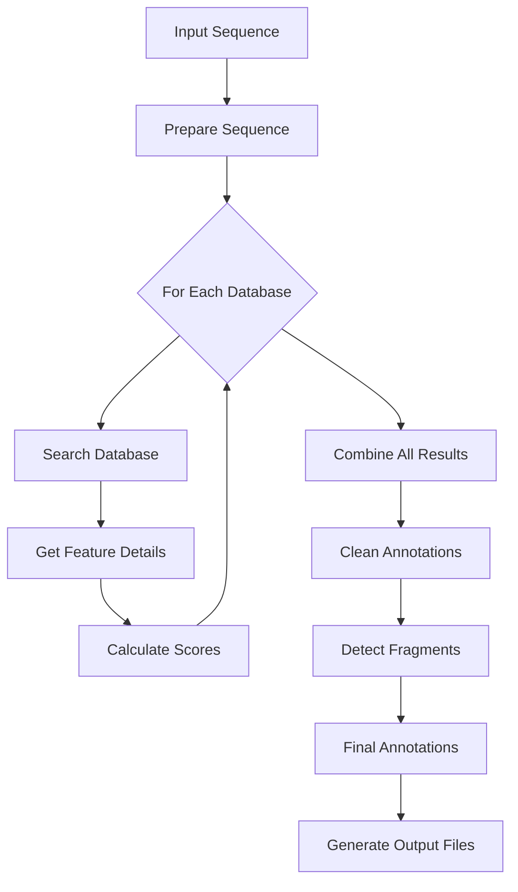

# pLannotate Snakemake Pipeline

This directory contains the modularized Snakemake pipeline for pLannotate. The pipeline has been refactored from a monolithic script into separate, maintainable modules.

## Architecture

The pipeline consists of the following modules:

### Core Modules

1. **search.py** - Handles database searches (BLAST, DIAMOND, Infernal)
   - `search_database()`: Runs searches against individual databases
   - Supports multiple search methods with a unified interface

2. **details.py** - Retrieves feature descriptions from various sources
   - `get_feature_details()`: Fetches and merges feature annotations
   - Handles compressed files and special cases (e.g., SwissProt)

3. **process.py** - Processes search results
   - `calculate_scores()`: Computes match scores and metrics
   - `clean_hits()`: Filters and removes overlapping features
   - `detect_fragments()`: Identifies partial features
   - `finalize_annotations()`: Prepares final output

4. **combine.py** - Combines results from multiple databases
   - `combine_results()`: Merges all database results
   - `prepare_sequence()`: Handles circular plasmid sequences

### Pipeline Flow



## Snakemake Rules

The pipeline is orchestrated by Snakemake with the following rules:

1. **prepare_sequence**: Validates and prepares input sequence
2. **search_database**: Runs searches in parallel for each database
3. **get_details**: Retrieves feature descriptions
4. **calculate_scores**: Computes match scores
5. **combine_databases**: Merges all database results
6. **clean_annotations**: Filters overlapping features
7. **finalize_annotations**: Final processing and fragment detection
8. **create_genbank**: Generates GenBank output
9. **create_visualization**: Optional Bokeh plot generation

## Usage

### As a Module

The pipeline maintains backward compatibility with the original API:

```python
from plannotate import annotate

# Basic usage
results = annotate.annotate(sequence_string)

# With options
results = annotate.annotate(
    sequence_string,
    linear=True,
    is_detailed=True,
    threads=8
)
```

### Command Line with Snakemake

```bash
# Run with config file
snakemake -s plannotate/Snakefile --configfile my_config.yaml --cores 4

# Run with command line config
snakemake -s plannotate/Snakefile \
    --config input_sequence="ATCG..." linear=True \
    --cores 4
```

### Configuration

See `config.yaml` for available options:
- `input_sequence`: DNA sequence string
- `linear`: Whether sequence is linear (default: False)
- `is_detailed`: Use detailed annotation types (default: False)
- `yaml_file`: Custom database configuration
- `output_dir`: Output directory for results
- `threads`: Number of parallel threads

## Benefits of Modularization

1. **Maintainability**: Each module has a single responsibility
2. **Extensibility**: Easy to add new databases or search methods
3. **Parallelization**: Snakemake handles parallel execution automatically
4. **Debugging**: Intermediate results are saved for inspection
5. **Reusability**: Modules can be used independently
6. **Testing**: Each module can be unit tested separately

## Adding New Databases

To add a new database:

1. Add database configuration to `databases.yml`
2. If needed, implement custom search logic in `search.py`
3. If needed, implement custom detail retrieval in `details.py`
4. The pipeline will automatically include the new database

## Intermediate Files

The pipeline creates intermediate files in the output directory:
- `prepared_sequence.fasta`: Input sequence (doubled if circular)
- `sequence_info.json`: Metadata about the sequence
- `searches/`: Directory with per-database results
- `combined_raw.csv`: All results before cleaning
- `cleaned_annotations.csv`: Results after overlap removal
- `final_annotations.csv`: Final annotations with fragments marked
- `final_annotations.gbk`: GenBank format output