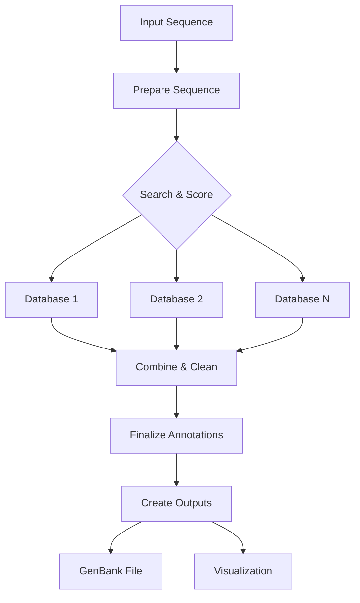

# pLannotate Snakemake Pipeline

This directory contains the modularized Snakemake pipeline for pLannotate. The pipeline has been refactored from a monolithic script into separate, maintainable modules with a streamlined workflow.

## Architecture

The pipeline consists of the following modules:

### Core Modules

1. **search.py** - Handles database searches (BLAST, DIAMOND, Infernal)
   - `search_database()`: Runs searches against individual databases
   - Supports multiple search methods with a unified interface

2. **details.py** - Retrieves feature descriptions from various sources
   - `get_feature_details()`: Fetches and merges feature annotations
   - Handles compressed files and special cases (e.g., SwissProt)

3. **process.py** - Processes search results
   - `calculate_scores()`: Computes match scores and metrics
   - `clean_hits()`: Filters and removes overlapping features
   - `detect_fragments()`: Identifies partial features
   - `finalize_annotations()`: Prepares final output

4. **combine.py** - Combines results from multiple databases
   - `combine_results()`: Merges all database results
   - `prepare_sequence()`: Handles circular plasmid sequences

### Pipeline Flow



## Snakemake Rules

The pipeline has been streamlined to 5 essential rules:

1. **prepare_sequence**: Validates and prepares input sequence (doubles for circular)
2. **search_and_score**: Searches each database and calculates scores with feature details
3. **combine_and_clean**: Combines all database results and removes overlaps
4. **finalize_annotations**: Detects fragments and finalizes annotations
5. **create_outputs**: Generates GenBank file and optional visualization

Each rule uses an external script in the `scripts/` directory for better maintainability.

## Scripts

The `scripts/` directory contains the implementation for each pipeline step:

- `prepare_sequence.py` - Sequence validation and preparation
- `search_and_score.py` - Database search, detail retrieval, and scoring
- `combine_and_clean.py` - Result combination and overlap removal
- `finalize_annotations.py` - Fragment detection and finalization
- `create_outputs.py` - GenBank and visualization generation

## Usage

### As a Module

The pipeline maintains backward compatibility with the original API:

```python
from plannotate import annotate

# Basic usage
results = annotate.annotate(sequence_string)

# With options
results = annotate.annotate(
    sequence_string,
    linear=True,
    is_detailed=True,
    threads=8
)
```

### Command Line with Snakemake

```bash
# Run with config file
snakemake -s plannotate/Snakefile --configfile my_config.yaml --cores 4

# Run with command line config
snakemake -s plannotate/Snakefile \
    --config input_sequence="ATCG..." linear=True \
    --cores 4
```

### Configuration

See `config.yaml` for available options:
- `input_sequence`: DNA sequence string
- `linear`: Whether sequence is linear (default: False)
- `is_detailed`: Use detailed annotation types (default: False)
- `yaml_file`: Custom database configuration
- `output_dir`: Output directory for results
- `threads`: Number of parallel threads
- `create_plot`: Whether to create visualization (default: True)

## Benefits of the Refactored Pipeline

1. **Cleaner Code**: External scripts instead of inline code blocks
2. **Streamlined Workflow**: Reduced from 9 to 5 meaningful rules
3. **Better Performance**: Related operations are combined
4. **Maintainability**: Each script has a clear purpose
5. **Parallelization**: Database searches run in parallel
6. **Debugging**: Intermediate results still available

## Adding New Databases

To add a new database:

1. Add database configuration to `databases.yml`
2. If needed, implement custom search logic in `search.py`
3. If needed, implement custom detail retrieval in `details.py`
4. The pipeline will automatically include the new database

## Output Files

The pipeline creates the following files in the output directory:
- `prepared_sequence.fasta`: Input sequence (doubled if circular)
- `sequence_info.json`: Metadata about the sequence
- `searches/`: Directory with per-database results
  - `{database}_results.csv`: Scored results for each database
- `combined_cleaned.csv`: Combined and cleaned results
- `final_annotations.csv`: Final annotations with fragments marked
- `final_annotations.gbk`: GenBank format output
- `plasmid_plot.html`: Interactive visualization (if enabled)